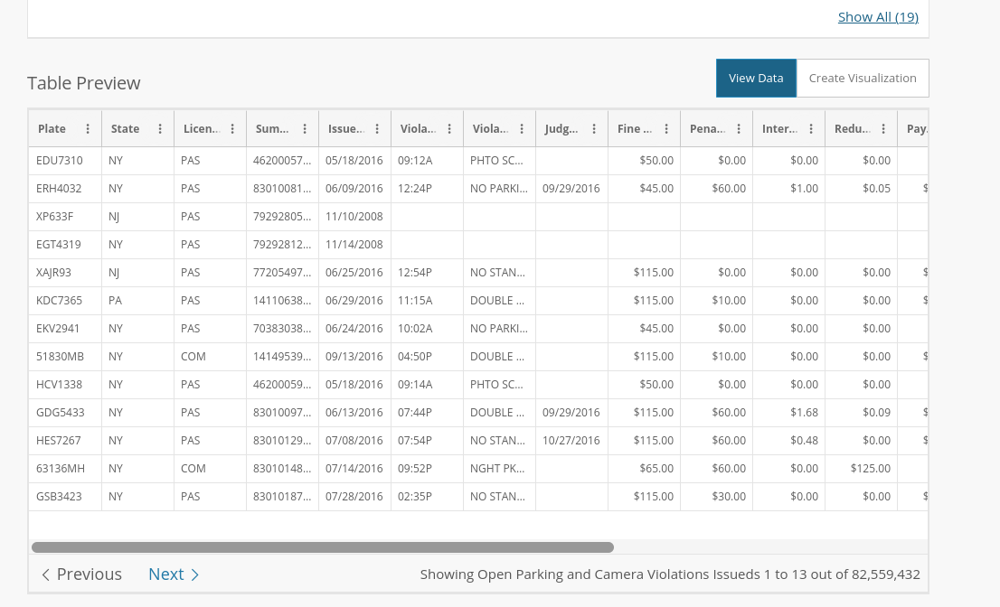
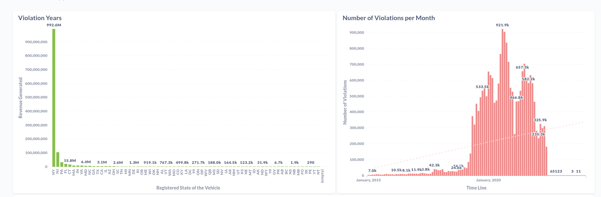

# Dataset Exploration

The **Open Parking and Camera Violations** dataset was initially loaded with all violations contained in the mainframe database as of May 2016. This Dataset is free to obtain via : [https://data.cityofnewyork.us/City-Government/Open-Parking-and-Camera-Violations/nc67-uf89](https://data.cityofnewyork.us/City-Government/Open-Parking-and-Camera-Violations/nc67-uf89)

## Reading and Defining Schema

After a simple observation and analysis of the Dataset preview, I’ve decide to make a read of the file with Spark 3.2.1



The Spark Session was defined as: 

```scala
val spark = SparkSession.builder().appName("ExploringDataset").config("spark.master","local").getOrCreate()
```

The first read was done to get a sample as:

```scala
*val DF = spark.read.options(Map("header"->"true", "sep"->",", "nullValue"->"", "inferSchema" -> true).csv(path)
DF.show(5)
Plate,State,License Type,Summons Number,Issue Date,Violation Time,Violation,Judgment Entry Date,Fine Amount,Penalty Amount,Interest Amount,Reduction Amount,Payment Amount,Amount Due,Precinct,County,Issuing Agency,Violation Status,Summons Image  
JAL2979,NY,PAS,4664359196,08/28/2019,06:56P,PHTO SCHOOL ZN SPEED VIOLATION,,50.00,0.00,0.00,0.00,50.00,0.00,000,BX,DEPARTMENT OF TRANSPORTATION,,View Summons (http://nycserv.nyc.gov/NYCServWeb/ShowImage?searchID=VGtSWk1rNUVUVEZQVkVVMVRtYzlQUT09&locationName=_____________________)*
```

After seeing how the Schema is predefined by the Spark itself with the option `inferSchema`, to increase the perfomance of reading, the variable `violationsSchema` was created. With the types: `StringType`, `DateType` and `DoubleType` Eg: 

```scala
val violationsSchema = StructType(Array(...
StructField("State", StringType),...
StructField("Issue Date", DateType),...
StructField("Violation", StringType),...
StructField("Payment Amount", DoubleType),...
StructField("Amount Due", DoubleType),...
StructField("Issuing Agency", StringType),..
) )
```

Now the `inferSchema` can be changed to `enforceSchema` and the reading method can be correctly defined with the `dateFormat (”MM/dd/yyyy”)` as viewed before. After that was possible to find a problem with the date column `Issue Date` described in the last part of this document.

To solve the problem with the column, Spark suggest the configuration bellow.

`spark.conf.set("spark.sql.legacy.timeParserPolicy", "LEGACY")`

```scala
val violationsDF = spark.read
    .schema(violationsSchema)
    .options(Map(
        "dateFormat" -> "MM/dd/yyyy",
        "mode"-> "PERMISSIVE",
        "enforceSchema" -> "true",
        "header" -> "true",
        "sep" -> ",",
        "nullValue" -> "")  ).csv(path
```

## Questions to answer with the dataset

### 1 - Wich state have more violations that have been payed or not from all data?

To this case I’ve decided creating two different `DataFrames` and joining them after in `outer` mode

```scala
val payStateDF = violationsDF.select(col("State"), col("Payment Amount"))
  .where("`Payment Amount` > 0").groupBy("State").agg(
  count("State").as("N_Records"),
  sum("Payment Amount").as("Total_Received"),
  round(avg("Payment Amount"),2).as("Average_Received")
)
val dueStateDF = violationsDF.select(col("State"), col("Amount Due"))
    .where("`Amount Due` > 0").groupBy("State").agg(
    count("State").as("N_Due_Records"),
    sum("Amount Due").as("Total_Amount_Due"),
    round(avg("Amount Due"),2).as("Average_Amount_Due")
  ).withColumnRenamed("State", "Due_State")

  val payVsDueDF = payStateDF
.join(dueStateDF, payStateDF.col("State") === dueStateDF.col("Due_State")
, "outer").drop("Due_State").orderBy(col("Total_Received").desc)
payVsDueDF.show(5)
+-----+---------+--------------------+----------------+-------------+--------------------+------------------+
|State|N_Records|Total_Received      |Average_Received|N_Due_Records|Total_Amount_Due    |Average_Amount_Due|
+-----+---------+--------------------+----------------+-------------+--------------------+------------------+
|NY   |14433305 |9.926286650999948E8 |68.77           |1065527      |1.1671728307002091E8|109.54            |
|NJ   |1392690  |1.0424775127999975E8|74.85           |247677       |2.6133882230002783E7|105.52            |
```

After the first interaction it was possible to understand that the `DoubleType` wasnt able to compute such large number described in the `Total_Received` or in the `Total_Amount_Due`.

So to all DataTypes that can do math operations such as `sum()` I’ve decided to change them to a 

*`val* decimalType =  DataTypes.createDecimalType(24,2)` and the result:

```scala
+-----+---------+--------------+----------------+-------------+----------------+------------------+
|State|N_Records|Total_Received|Average_Received|N_Due_Records|Total_Amount_Due|Average_Amount_Due|
+-----+---------+--------------+----------------+-------------+----------------+------------------+
|NY   |14433305 |992628665.10  |68.77           |1065527      |116717283.07    |109.54            |
|NJ   |1392690  |104247751.28  |74.85           |247677       |26133882.23     |105.52            |
```

### 2 - What is the mean price of payed ticket vs the standard deviation?

The standard deviation shows the data are aggregated closer to the mean

```scala
val avgDF = violationsDF.select(
    round(mean("`Payment Amount`"),2).as("Mean_Ticket"),
    round(stddev("`Payment Amount`"),2).as("STD_Ticket")  )
avgDF.show(false)
+-----------+----------+
|Mean_Ticket|STD_Ticket|
+-----------+----------+
|59.63      |37.83     |
+-----------+----------+
```

### 3 - Is the revenue generated by payed tickets increasing?

The data show us that we have a ***reduction of violations*** between the two months with the most number of violations in recent years

```scala
val yearVsMonthDF = violationsDF.withColumn("Year_Month", 
concat(month(col("`Issue Date`")),lit('/'),year(col("`Issue Date`")) ) )
    .groupBy("Year_Month").agg(
    count("Year_Month").as("N_Violations"),
    sum("Payment Amount").as("Total_Received"),
    sum("Amount Due").as("Total_Amount_Due")
  ).orderBy(col("N_Violations").desc)
yearVsMonthDF.show(false)
+----------+------------+--------------+----------------+
|Year_Month|N_Violations|Total_Received|Total_Amount_Due|
+----------+------------+--------------+----------------+
|8/2020    |921938      |55455616.84   |4711470.20      |
|9/2020    |904525      |55160611.93   |4754601.75      |
|10/2020   |837122      |52021293.53   |4561952.68      |
|7/2020    |764653      |43686908.68   |4357929.42      |
|11/2020   |715016      |43722048.06   |4049726.60      |
|7/2021    |702951      |42236481.26   |3940518.33      |
```

### 4 - What is the most commom violation that are payed by the users in the recent years?

The most commom violation issued is *`PHTO SCHOOL ZN SPEED VIOLATION`* and we have almost 10% of increase of that violation from 2020 to 2021. From 2019 to 2021 the increase was 426%.

```scala
val violationYearDF = violationsDF.selectExpr(
    "year(`Issue Date`) as Year",
    "`Issuing Agency`",
    "Violation"
  ).where("`Payment Amount` > 0").groupBy("Year","`Issuing Agency`", "Violation")
   .agg( ("Violation").as("N_Violations") )
.orderBy(col("N_Violations").desc)
violationYearDF.show(5,false)
|Year|Issuing Agency              |Violation                     |N_Violations|
+----+----------------------------+------------------------------+------------+
|2021|DEPARTMENT OF TRANSPORTATION|PHTO SCHOOL ZN SPEED VIOLATION|3273703     |
|2020|DEPARTMENT OF TRANSPORTATION|PHTO SCHOOL ZN SPEED VIOLATION|2912322     |
|2019|DEPARTMENT OF TRANSPORTATION|PHTO SCHOOL ZN SPEED VIOLATION|768042      |
|2020|TRAFFIC                     |NO PARKING-STREET CLEANING    |610555      |
|2020|TRAFFIC                     |FAIL TO DSPLY MUNI METER RECPT|479064      |
```

## Problems found

### Problem 1

The first problem found was regarding the Spark’s delay to process the DataSet.

The Spark session was set to local with only 1 core and 1Gb of Ram to process everything, when the Scala Object was executed, the Spark understood that it was needed to read the entire CSV file to each operation that we did to answer the questions. The average time to execute the entire code was 50 Minutes

The cause of that was **Wide Transformations** that we were executing in the code, such as **Joins, filters, aggs.** Trying to solve that I’ve setup an local cluster with Docker with 3 workers and tried to increase the perfomance. I’ve been able to generate the JAR of the project and tried to run the class via spark-submit, but the perfomance didn’t increase too much. The average time to execute the spark-submit was 40 minutes.

After that I’ve tried to do some configuration with the Main Dataframe and the best approach I found to reduce costs of that it was creating a intermediate DataFrame selecting the fields that we need to answer those questions above, and doing a `repartition()` to increase the perfomance.

Finally what worked was the combination of `Coalesce()` and `Persist()`. The **coalesce()** reduce the number of partitions and the **persist()** maintain the data by default in`MEMORY_AND_DISK` . The average time to execute the code after that was 5 minutes.

```scala
val aggDF = violationsDF.selectExpr(
  "State",
  "`Issue Date`",
  "Violation",
  "`Payment Amount`",
  "`Amount Due`",
  "`Issuing Agency`" )
.coalesce(20).persist()
```

### Problem 2

The second problem found was: Incorrect Data in the field `Issue Date` Some rows have impossibles dates to convert such as: `Summons Number = *1464546344` that shows `11/31/2020` or* *`1459704782` that shows the date `11/31/2019`*

Two direct solutions can be achieved by doing a configuration in the SparkSession

`spark.conf.set("spark.sql.legacy.timeParserPolicy", "CORRECTED")` OR

`spark.conf.set("spark.sql.legacy.timeParserPolicy", "LEGACY")`

The first one sets the incorrect date in columm to NULL and puts all the data information regards the row in a column by default: `_corrupt_record` that also need to be declared in the schema

The second sets the incorrect date to an correct date, the next valid date. 11/31/2020 → 12/01/2020 and the second from 11/31/2019 → 12/01/2019.

The number of rows identified with this problem is: **102 of 21.573.140**

After these problems adressed here have been solved the final touch was develop an method to save the results of those questions into an format desired, in this case CSV files so it was possible to check the results manually and generate views with that data.

The Main method created in the `ViolationsProcessor scala object`  receives 2 parameters.

1 - Path of the dataset, 2 - Output of processing 




# Second exploration
The second exploration that I'm trying to do is: Encounter how the data is Seasonal and if we have Outliers
Using the scala object ViolationsProcessorSec I'm trying to change the approach to some problems with perfomance.
First of all, trying to create a new DataSet with the reference from the main Dataframe.

For that I need to change the column names Replacing the " " between the fields to "_"
After that I'm doing some analysis with the AVG of the data by days of week and comparing itself to
Each day of week in the Month of Year 2021.


# FROM RJVM Spark essentials README.md
This repository contains the code we wrote during  [Rock the JVM's Spark Essentials with Scala](https://rockthejvm.com/course/spark-essentials) (Udemy version [here](https://udemy.com/spark-essentials)) Unless explicitly mentioned, the code in this repository is exactly what was caught on camera.

## How to install

- install [Docker](https://docker.com)
- either clone the repo or download as zip
- open with IntelliJ as an SBT project
- in a terminal window, navigate to the folder where you downloaded this repo and run `docker-compose up` to build and start the PostgreSQL container - we will interact with it from Spark
- in another terminal window, navigate to `spark-cluster/` 
- Linux/Mac users: build the Docker-based Spark cluster with
```
chmod +x build-images.sh
./build-images.sh
```
- Windows users: build the Docker-based Spark cluster with
```
build-images.bat
```
- when prompted to start the Spark cluster, go to the `spark-cluster` directory and run `docker-compose up --scale spark-worker=3` to spin up the Spark containers with 3 worker nodes

### A Note For Windows users: Adding Winutils

By default, Spark will be unable to write files using the local Spark executor. To write files, you will need to install the Windows Hadoop binaries, aka [winutils](https://github.com/cdarlint/winutils). You can take the latest binary (Hadoop 3.2 as of June 2022), or use Hadoop 2.7 as a fallback.

After you download winutils.exe, create a directory anywhere (e.g. `C:\\winutils`), then create a `bin` directory under that, then place the winutils executable there.

You will also need to set the `HADOOP_HOME` environment variable to your directory where you added `bin\winutils.exe`. In the example above, that would be `C:\\winutils`.

An alternative to setting the environment variable is to add this line at the beginning of every Spark application we write:

```scala
System.setProperty("hadoop.home.dir","C:\\hadoop") // replace C:\\hadoop with your actual directory
```

### How to start

Clone this repository and checkout the `start` tag by running the following in the repo folder:

```
git checkout start
```

### How to see the final code

Udemy students: checkout the `udemy` branch of the repo:
```
git checkout udemy
```

Premium students: checkout the master branch:
```
git checkout master
```

### How to run an intermediate state

The repository was built while recording the lectures. Prior to each lecture, I tagged each commit so you can easily go back to an earlier state of the repo!

The tags are as follows:

* `start`
* `1.1-scala-recap`
* `2.1-dataframes`
* `2.2-dataframes-basics-exercise`
* `2.4-datasources`
* `2.5-datasources-part-2`
* `2.6-columns-expressions`
* `2.7-columns-expressions-exercise`
* `2.8-aggregations`
* `2.9-joins`
* `2.10-joins-exercise`
* `3.1-common-types`
* `3.2-complex-types`
* `3.3-managing-nulls`
* `3.4-datasets`
* `3.5-datasets-part-2`
* `4.1-spark-sql-shell`
* `4.2-spark-sql`
* `4.3-spark-sql-exercises`
* `5.1-rdds`
* `5.2-rdds-part-2`

And for premium students, in addition:

* `6.1-spark-job-anatomy`
* `6.2-deploying-to-cluster`
* `7.1-taxi`
* `7.2-taxi-2`
* `7.3-taxi-3`
* `7.4-taxi-4`

When you watch a lecture, you can `git checkout` the appropriate tag and the repo will go back to the exact code I had when I started the lecture.

### For questions or suggestions

If you have changes to suggest to this repo, either
- submit a GitHub issue
- tell me in the course Q/A forum
- submit a pull request!
